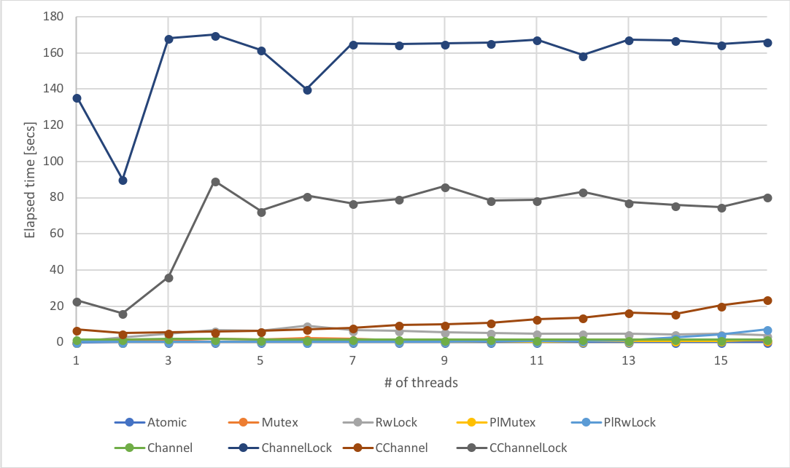

# coninc: benchmark of concurrent increments

## Usage

```
Benchmark of concurrent increments.

Multiple threads increments a integer concurrently in some thread-safe ways.

Usage:
  coninc [option] <kind> <n_threads> <n_incs>
  coninc (-h | --help)

Arguments:
  kind       Thread-safe implementation:
               Atomic        Use AtomicUsize.
               Mutex         Use Mutex.
               RwLock        Use RwLock.
               PlMutex       parking_lot version of Mutex.
               PlRwLock      parking_lot version of RwLock.
               Channel       Send increments by mpsc channel.
               ChannelLock   Use channel-based lock.
               CChannel      crossbeam-channel version of Channel.
               CChannelLock  crossbeam-channel version of ChannelLock.
  n_threads  # of threads.
  n_incs     # of total increments across threads.

Options:
  -h --help      Show this message.
```

## Types of thread-safe increments

- `Atomic`: Call `AtomicUsize.fetch_add` to increment the value by 1.
- `Mutex`: Call `Mutex.lock` and increment the value by 1.
- `RwLock`: Call `RwLock.write` and increment the value by 1.
- `PlMutex`: Same as `Mutex` except for using [parking_lot](https://github.com/Amanieu/parking_lot).
- `PlRwLock` Same as `RwLock` except for using [parking_lot](https://github.com/Amanieu/parking_lot).
- `Channel`: Send increment value to the dedicated thread which onws and increments the value.
- `ChannelLock`: The dedicated thread owns the value and handles lock/unlock requests from other threads, sending back the pointer to the value.
- `CChannel`: Same as `Channel` except for using [crossbeam-channel](https://github.com/crossbeam-rs/crossbeam-channel).
- `CChannelLock`: Same as `CChannelLock` except for using [crossbeam-channel](https://github.com/crossbeam-rs/crossbeam-channel).

## Result

- `n_threads = 1 to 16`
- `n_incs = 7207200`
- Tested on
  - Rust 1.26.2
  - CentOS 6.9
  - Intel(R) Xeon(R) CPU E5-2690 v2 @ 3.00GHz

### Elapsed time [secs]

| n_threads | Atomic   | Mutex    | RwLock   | PlMutex  | PlRwLock | Channel  | ChannelLock | CChannel  | CChannelLock |
| --------- | -------- | -------- | -------- | -------- | -------- | -------- | ----------- | --------- | ------------ |
| 1         | 0.135044 | 0.44486  | 0.432963 | 0.311909 | 0.311892 | 1.660842 | 135.869249  | 7.187559  | 23.336467    |
| 2         | 0.424366 | 1.055221 | 2.685781 | 0.441951 | 0.44366  | 1.69995  | 90.147625   | 5.135753  | 16.182708    |
| 3         | 0.393995 | 1.27532  | 4.718424 | 0.486134 | 0.471486 | 2.168259 | 168.227675  | 5.653758  | 36.354357    |
| 4         | 0.439026 | 2.025082 | 6.846436 | 0.476681 | 0.56188  | 1.877063 | 170.044111  | 5.889568  | 89.369276    |
| 5         | 0.423856 | 1.621145 | 6.32489  | 0.573529 | 0.515277 | 1.598412 | 161.786587  | 6.399021  | 72.726552    |
| 6         | 0.37678  | 2.453937 | 9.357491 | 0.501398 | 0.283392 | 1.613748 | 140.011369  | 7.453375  | 81.178553    |
| 7         | 0.33468  | 1.927198 | 6.847492 | 0.483433 | 0.579893 | 1.776712 | 165.186152  | 8.233199  | 76.931881    |
| 8         | 0.393683 | 1.343083 | 6.527845 | 0.577796 | 0.586252 | 1.733008 | 164.807489  | 9.848965  | 79.326833    |
| 9         | 0.397351 | 1.204466 | 5.79129  | 0.589374 | 0.550044 | 1.568485 | 165.178816  | 9.924787  | 86.478346    |
| 10        | 0.334035 | 1.145435 | 5.446258 | 0.752015 | 0.845336 | 1.718951 | 165.663809  | 10.9393   | 78.647122    |
| 11        | 0.341767 | 1.116832 | 5.067555 | 0.480645 | 0.845553 | 1.550962 | 167.363931  | 12.948569 | 78.706785    |
| 12        | 0.343098 | 1.230938 | 4.996113 | 0.696171 | 0.881862 | 1.844942 | 158.827614  | 13.878977 | 83.315568    |
| 13        | 0.387947 | 1.032506 | 4.866772 | 0.668181 | 1.060274 | 1.509321 | 167.387514  | 16.567955 | 77.495529    |
| 14        | 0.415771 | 1.084134 | 4.627196 | 0.967926 | 2.76307  | 1.781026 | 167.057118  | 15.884212 | 75.855206    |
| 15        | 0.374734 | 1.289157 | 4.848018 | 0.868018 | 4.458787 | 1.593451 | 164.772751  | 20.349558 | 74.877095    |
| 16        | 0.397678 | 1.124393 | 3.990821 | 1.623853 | 7.317098 | 1.76703  | 166.434441  | 23.816891 | 80.725223    |


